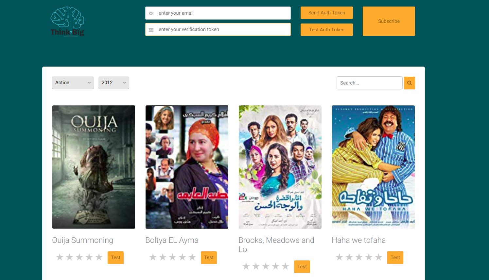

# Movie Recommendations Fe Assignment
This repository contains an assignment for our summer interns'19 candidates.

## Description 
In this assignment you are required to download the code in this repository 
and update it "as you wish" adding your piece of mind. 

## Ideation 
This code is for the front-end we will be using with our movie recommendations 
engine, which is currently work in progress. Simply through this game application, 
users can visit the website (for which this is the front-end), where they can 
rate several movies and subscribe to our service. In return at the end of each 
month we will send them recommended movies that we think they would like the 
most - based on the ratings they have provided previously. There are of course 
lots of other features that we don't tell here ;) we'll keep it a surprise when 
they are implemented. 




## Features supported by the front end 
As can be seen from the image below the features included are: 
 - Header Section Controls
   - Visitor will enter his email address. In return our WebServer will send an authentication token to the email address provided
   - Visitor will verify their email address by entering the received authentication token 
   - Visitor can subscribe/unsubscribe to our service (same button, which will change based on the user status, i.e. subscribed or not)
 - Movies Section Controls 
   - Visitor can search for a movie (right search panel)
   - Visitor can filter the movies by year or type (left drop down lists)
     - This shall be implemented as checkboxes on the left side of the movies, to allow the visitor to check multiple types and years. 
     - For reference, please check [here](https://egypt.souq.com/eg-en/mobile/s/?page=1)
   - Visitor can get the next batch of movies. We are not including that button in the page, you decide where is best place to have it 
   - For each movie
     - Visitor can provide a rating 
     - Visitor can ask us to provide him "his learned rating" (the test button, ehm, u can call it something else )

## What exactly do u need to know 
The image below shows the basic functionality of the front-end. This is what you shall see the u run the project. Simply run the ```index.html``` file (nothing special here). 
If you want to solve that assignment you need to do two things 
 - You need to rework that page ```index.html```. You can already tell the design sucks (who adds controls in the header). 
 **Be creative please**. You can add a nice banner, more controls, less controls, ...etc. However please preserve the application functionality we specified above. 
 - Next to a creative design, we have highlighted some bugs, like ex. a movie name exceeding a single line. What to do here ? 

## How to do that
 - Fork this repository
 - Update the forked repository adding your piece of mind 
 - Push the new updates to your forked repository 
 - In the forked repository, u can remove this ReadMe.md file and add a new 
 file describing the changes you have made. Please also include a picture with 
 the new design 
 - Send us an email with the new repository url 
 
## More information 
  - You can continue work on the template provided (here is the [original template](https://www.themezy.com/demos/10-movie-reviews-responsive-template) ), or find your own template. It's up to you.
  - You don't need to do anything in regards to the backend. Just do the static design. 
  - If u have any questions, please contact us: info@think-big.solutions
  

##GoodLuck
